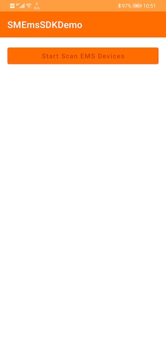
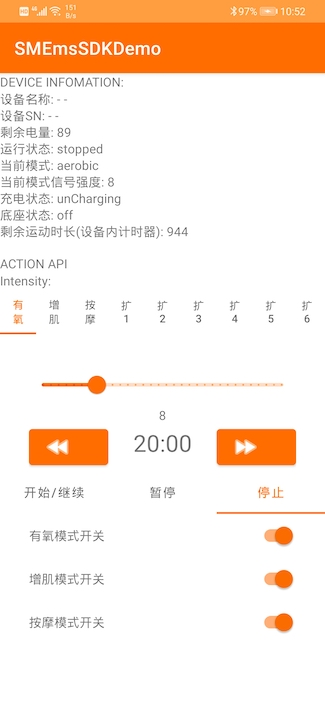

# SMEmsSDK-Android

## VersionLog

|version|log|
|:-:|:-:|
|1.0.2| Fixed SN missing last 2 chars.|
|1.0.1| Fixed EMS Device's remain exercise second error.|
|1.0.0|First version|


## Installation

### From Github
#### Step1: 

Add `maven { url "https://raw.githubusercontent.com/Shenzhen-Simo-Technology-co-LTD/SMEmsSDK-Android/main" }` into Build build.gradle(Project):


```gradle
allprojects {
    repositories {
        google()
        jcenter()

        maven { url "https://raw.githubusercontent.com/Shenzhen-Simo-Technology-co-LTD/SMEmsSDK-Android/main" }
    }
}
```

### Step2:

Add `implementation 'com.simo:SMEmsSDK:1.0.2'` into build.gradle(Module) dependencies scope:

```gradle
dependencies {
	...
	implementation 'com.simo:SMEmsSDK:1.0.2'
	...
}
```

### From Local
#### Step1:
Download the AAR file from github manually.
[Download Address](https://github.com/Shenzhen-Simo-Technology-co-LTD/SMEmsSDK-Android/tree/main/com/simo/SMEmsSDK)

And put it into your project directory.

#### Step2:

Add `implementation(name:'SMEmsSDK-1.0.2', ext:'aar')` into build.gradle(Module) dependencies scope:

```gradle
dependencies {
	...
	implementation(name:'SMEmsSDK-1.0.2', ext:'aar')
	...
}
```


## Screenshot



